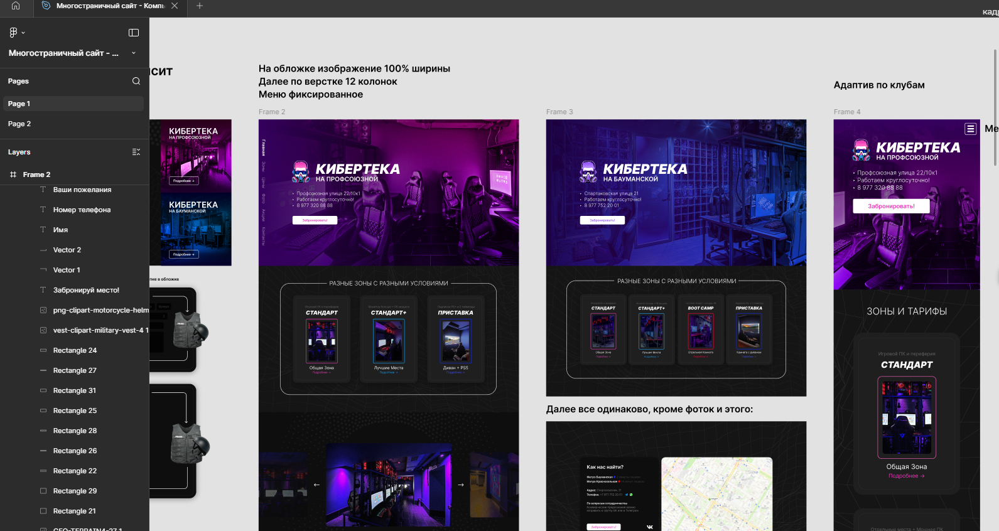

# КИБЕРТЕКА

**Компьютерный клуб**

### [Посмотреть макет в Figma](https://www.figma.com/design/Bn5MOtlOp5voNB3L0ycbl6/%D0%9C%D0%BD%D0%BE%D0%B3%D0%BE%D1%81%D1%82%D1%80%D0%B0%D0%BD%D0%B8%D1%87%D0%BD%D1%8B%D0%B9-%D1%81%D0%B0%D0%B9%D1%82---%D0%9A%D0%BE%D0%BC%D0%BF%D1%8C%D1%8E%D1%82%D0%B5%D1%80%D0%BD%D1%8B%D0%B9-%D0%BA%D0%BB%D1%83%D0%B1?node-id=0-1&p=f&t=cTIUMg1tSUMQ9p4r-0)

---

### О проекте

**WEB-сайт для компьютерного клуба «КИБЕРТЕКА»**

Многостраничный сайт, выполненный на **чистом HTML, CSS и JavaScript** без использования фреймворков.

### Основные возможности и технологии:

- Адаптивная вёрстка полностью на чистых `@media`-запросах
- Плавные hover-анимации и интерактивность на каждом элементе
- Модальные окна
- Анимации при инициализации страницы (появление элементов)
- Интеграция с **Яндекс.Картами** (API)
- Кроссбраузерность и современный дизайн
- Удобная навигация и интуитивный интерфейс

---

### Технологии

- **HTML5**
- **CSS3** (Flexbox, Grid, анимации, переменные)
- **Vanilla JavaScript** (ES6+)
- Яндекс.Карты API
- Figma (дизайн-макет)

---

### Структура сайта

- `index.html` — Инициализирующая страница
- `bauman/profsouz.html` — О клубе (На Бауманской и Профсоюзной)
- `profprice/profbauman.html` — Страницы с тарифами и картой 
- `baumanBoot` — Страницы по типу этой, редирект для каждого тарифа
- `js/` — Папка с JS - сценариями
- `img/` — Папка с изображениями, иконками и т.д.
- `components/` — Папка с компонентами (модально окно)
- `css/` — Папка с css стилями
---

### Как запустить проект локально

1. Скачай репозиторий
2. Запусти проект через live сервер
            или
2. Открой файл `index.html` в любом браузере (В таком случае могут не работать некоторые JS сценарии)

---

 **Год:** 2026  
**Дисциплина:** Web-технологии (курсовая работа)

---

*Сайт разработан в рамках курсовой работы СПбГУАП*